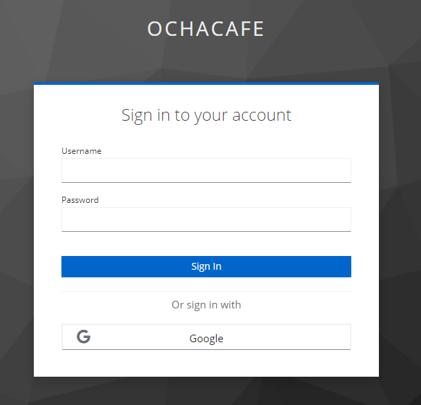
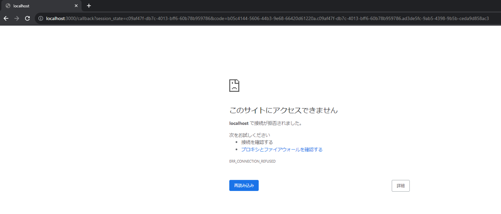

# OIDC - curl RP

OpenID Connect - Discovery Endpoint を実行する。

```http
@keycloak = https://keycloak.shukawam.me
@oidc_well_known = realms/ochacafe/.well-known/openid-configuration

###
# @name well_known
GET {{keycloak}}/{{oidc_well_known}} HTTP/1.1
```

以下のレスポンスが返却される。

```json
{
  "issuer": "https://keycloak.shukawam.me/realms/ochacafe",
  "authorization_endpoint": "https://keycloak.shukawam.me/realms/ochacafe/protocol/openid-connect/auth",
  "token_endpoint": "https://keycloak.shukawam.me/realms/ochacafe/protocol/openid-connect/token",
  "introspection_endpoint": "https://keycloak.shukawam.me/realms/ochacafe/protocol/openid-connect/token/introspect",
  "userinfo_endpoint": "https://keycloak.shukawam.me/realms/ochacafe/protocol/openid-connect/userinfo",
  "end_session_endpoint": "https://keycloak.shukawam.me/realms/ochacafe/protocol/openid-connect/logout",
  "frontchannel_logout_session_supported": true,
  "frontchannel_logout_supported": true,
  "jwks_uri": "https://keycloak.shukawam.me/realms/ochacafe/protocol/openid-connect/certs",
  "check_session_iframe": "https://keycloak.shukawam.me/realms/ochacafe/protocol/openid-connect/login-status-iframe.html",
  "grant_types_supported": [
    "authorization_code",
    "implicit",
    "refresh_token",
    "password",
    "client_credentials",
    "urn:ietf:params:oauth:grant-type:device_code",
    "urn:openid:params:grant-type:ciba"
  ],
  "acr_values_supported": ["0", "1"],
  "response_types_supported": [
    "code",
    "none",
    "id_token",
    "token",
    "id_token token",
    "code id_token",
    "code token",
    "code id_token token"
  ],
  "subject_types_supported": ["public", "pairwise"],
  "id_token_signing_alg_values_supported": [
    "PS384",
    "ES384",
    "RS384",
    "HS256",
    "HS512",
    "ES256",
    "RS256",
    "HS384",
    "ES512",
    "PS256",
    "PS512",
    "RS512"
  ],
  "id_token_encryption_alg_values_supported": [
    "RSA-OAEP",
    "RSA-OAEP-256",
    "RSA1_5"
  ],
  "id_token_encryption_enc_values_supported": [
    "A256GCM",
    "A192GCM",
    "A128GCM",
    "A128CBC-HS256",
    "A192CBC-HS384",
    "A256CBC-HS512"
  ],
  "userinfo_signing_alg_values_supported": [
    "PS384",
    "ES384",
    "RS384",
    "HS256",
    "HS512",
    "ES256",
    "RS256",
    "HS384",
    "ES512",
    "PS256",
    "PS512",
    "RS512",
    "none"
  ],
  "userinfo_encryption_alg_values_supported": [
    "RSA-OAEP",
    "RSA-OAEP-256",
    "RSA1_5"
  ],
  "userinfo_encryption_enc_values_supported": [
    "A256GCM",
    "A192GCM",
    "A128GCM",
    "A128CBC-HS256",
    "A192CBC-HS384",
    "A256CBC-HS512"
  ],
  "request_object_signing_alg_values_supported": [
    "PS384",
    "ES384",
    "RS384",
    "HS256",
    "HS512",
    "ES256",
    "RS256",
    "HS384",
    "ES512",
    "PS256",
    "PS512",
    "RS512",
    "none"
  ],
  "request_object_encryption_alg_values_supported": [
    "RSA-OAEP",
    "RSA-OAEP-256",
    "RSA1_5"
  ],
  "request_object_encryption_enc_values_supported": [
    "A256GCM",
    "A192GCM",
    "A128GCM",
    "A128CBC-HS256",
    "A192CBC-HS384",
    "A256CBC-HS512"
  ],
  "response_modes_supported": [
    "query",
    "fragment",
    "form_post",
    "query.jwt",
    "fragment.jwt",
    "form_post.jwt",
    "jwt"
  ],
  "registration_endpoint": "https://keycloak.shukawam.me/realms/ochacafe/clients-registrations/openid-connect",
  "token_endpoint_auth_methods_supported": [
    "private_key_jwt",
    "client_secret_basic",
    "client_secret_post",
    "tls_client_auth",
    "client_secret_jwt"
  ],
  "token_endpoint_auth_signing_alg_values_supported": [
    "PS384",
    "ES384",
    "RS384",
    "HS256",
    "HS512",
    "ES256",
    "RS256",
    "HS384",
    "ES512",
    "PS256",
    "PS512",
    "RS512"
  ],
  "introspection_endpoint_auth_methods_supported": [
    "private_key_jwt",
    "client_secret_basic",
    "client_secret_post",
    "tls_client_auth",
    "client_secret_jwt"
  ],
  "introspection_endpoint_auth_signing_alg_values_supported": [
    "PS384",
    "ES384",
    "RS384",
    "HS256",
    "HS512",
    "ES256",
    "RS256",
    "HS384",
    "ES512",
    "PS256",
    "PS512",
    "RS512"
  ],
  "authorization_signing_alg_values_supported": [
    "PS384",
    "ES384",
    "RS384",
    "HS256",
    "HS512",
    "ES256",
    "RS256",
    "HS384",
    "ES512",
    "PS256",
    "PS512",
    "RS512"
  ],
  "authorization_encryption_alg_values_supported": [
    "RSA-OAEP",
    "RSA-OAEP-256",
    "RSA1_5"
  ],
  "authorization_encryption_enc_values_supported": [
    "A256GCM",
    "A192GCM",
    "A128GCM",
    "A128CBC-HS256",
    "A192CBC-HS384",
    "A256CBC-HS512"
  ],
  "claims_supported": [
    "aud",
    "sub",
    "iss",
    "auth_time",
    "name",
    "given_name",
    "family_name",
    "preferred_username",
    "email",
    "acr"
  ],
  "claim_types_supported": ["normal"],
  "claims_parameter_supported": true,
  "scopes_supported": [
    "openid",
    "offline_access",
    "address",
    "email",
    "acr",
    "cowsay:think",
    "web-origins",
    "profile",
    "groups",
    "roles",
    "phone",
    "microprofile-jwt",
    "cowsay:say"
  ],
  "request_parameter_supported": true,
  "request_uri_parameter_supported": true,
  "require_request_uri_registration": true,
  "code_challenge_methods_supported": ["plain", "S256"],
  "tls_client_certificate_bound_access_tokens": true,
  "revocation_endpoint": "https://keycloak.shukawam.me/realms/ochacafe/protocol/openid-connect/revoke",
  "revocation_endpoint_auth_methods_supported": [
    "private_key_jwt",
    "client_secret_basic",
    "client_secret_post",
    "tls_client_auth",
    "client_secret_jwt"
  ],
  "revocation_endpoint_auth_signing_alg_values_supported": [
    "PS384",
    "ES384",
    "RS384",
    "HS256",
    "HS512",
    "ES256",
    "RS256",
    "HS384",
    "ES512",
    "PS256",
    "PS512",
    "RS512"
  ],
  "backchannel_logout_supported": true,
  "backchannel_logout_session_supported": true,
  "device_authorization_endpoint": "https://keycloak.shukawam.me/realms/ochacafe/protocol/openid-connect/auth/device",
  "backchannel_token_delivery_modes_supported": ["poll", "ping"],
  "backchannel_authentication_endpoint": "https://keycloak.shukawam.me/realms/ochacafe/protocol/openid-connect/ext/ciba/auth",
  "backchannel_authentication_request_signing_alg_values_supported": [
    "PS384",
    "ES384",
    "RS384",
    "ES256",
    "RS256",
    "ES512",
    "PS256",
    "PS512",
    "RS512"
  ],
  "require_pushed_authorization_requests": false,
  "pushed_authorization_request_endpoint": "https://keycloak.shukawam.me/realms/ochacafe/protocol/openid-connect/ext/par/request",
  "mtls_endpoint_aliases": {
    "token_endpoint": "https://keycloak.shukawam.me/realms/ochacafe/protocol/openid-connect/token",
    "revocation_endpoint": "https://keycloak.shukawam.me/realms/ochacafe/protocol/openid-connect/revoke",
    "introspection_endpoint": "https://keycloak.shukawam.me/realms/ochacafe/protocol/openid-connect/token/introspect",
    "device_authorization_endpoint": "https://keycloak.shukawam.me/realms/ochacafe/protocol/openid-connect/auth/device",
    "registration_endpoint": "https://keycloak.shukawam.me/realms/ochacafe/clients-registrations/openid-connect",
    "userinfo_endpoint": "https://keycloak.shukawam.me/realms/ochacafe/protocol/openid-connect/userinfo",
    "pushed_authorization_request_endpoint": "https://keycloak.shukawam.me/realms/ochacafe/protocol/openid-connect/ext/par/request",
    "backchannel_authentication_endpoint": "https://keycloak.shukawam.me/realms/ochacafe/protocol/openid-connect/ext/ciba/auth"
  }
}
```

Web ブラウザで以下の URL を開く。（=認証リクエストを実行する）

`<authorization_endpoint>?client_id=<client-id>&response_type=code&redirect_uri=http://localhost:3000/callback&scope=openid`

e.g. `https://keycloak.shukawam.me/realms/ochacafe/protocol/openid-connect/auth?client_id=curl-rp&response_type=code&redirect_uri=http://localhost:3000/callback&scope=openid`



localhost:3000 で何もアプリケーションを実行していないので、エラー画面が返却されますが、問題ございません。



トークンリクエストを実行する。Keycloak の URL, client_secret や code はご自身の環境に合わせて修正してください。

```http
@keycloak = https://keycloak.shukawam.me
@client_id = curl-rp
@client_secret = 90d6dec4-af3f-417a-87a1-0b7ccc9c2942
@code = 4b39ee31-d9d8-48f6-b12b-2f289d6846ed.c09af47f-db7c-4013-bff6-60b78b959786.ad3de5fc-9ab5-4398-9b5b-ceda9d858ac3

POST {{keycloak}}/realms/ochacafe/protocol/openid-connect/token HTTP/1.1
Content-Type: application/x-www-form-urlencoded

grant_type=authorization_code&client_id={{client_id}}&client_secret={{client_secret}}&code={{code}}&redirect_uri=http://localhost:3000/callback
```

以下のレスポンスが返却される。

```json
{
  "access_token": "eyJhbGciOiJSUzI1NiIsInR5cCIgOiAiSldUIiwia2lkIiA6ICJLQWE2X1NPcnVLV1RaTjF6U1FnWF9WSHV3bE43RlFFb0lsQmlnQVRqUnIwIn0.eyJleHAiOjE2OTM4MDk1MzAsImlhdCI6MTY5MzgwOTIzMCwiYXV0aF90aW1lIjoxNjkzODA4OTM2LCJqdGkiOiJlMWFjMmU1NS1hNjU1LTQ2NGItOTAzOS02ODc0YzUyMzk4ZTMiLCJpc3MiOiJodHRwczovL2tleWNsb2FrLnNodWthd2FtLm1lL3JlYWxtcy9vY2hhY2FmZSIsImF1ZCI6ImFjY291bnQiLCJzdWIiOiJmZDhmYzNkMy0wYTM5LTQxZjctOTQ2OC00NTkyNmY2NThlNDEiLCJ0eXAiOiJCZWFyZXIiLCJhenAiOiJjdXJsLXJwIiwic2Vzc2lvbl9zdGF0ZSI6ImMwOWFmNDdmLWRiN2MtNDAxMy1iZmY2LTYwYjc4Yjk1OTc4NiIsImFjciI6IjAiLCJyZWFsbV9hY2Nlc3MiOnsicm9sZXMiOlsib2ZmbGluZV9hY2Nlc3MiLCJkZWZhdWx0LXJvbGVzLW9jaGFjYWZlIiwidW1hX2F1dGhvcml6YXRpb24iXX0sInJlc291cmNlX2FjY2VzcyI6eyJhY2NvdW50Ijp7InJvbGVzIjpbIm1hbmFnZS1hY2NvdW50IiwibWFuYWdlLWFjY291bnQtbGlua3MiLCJ2aWV3LXByb2ZpbGUiXX19LCJzY29wZSI6Im9wZW5pZCBwcm9maWxlIGVtYWlsIiwic2lkIjoiYzA5YWY0N2YtZGI3Yy00MDEzLWJmZjYtNjBiNzhiOTU5Nzg2IiwiZW1haWxfdmVyaWZpZWQiOnRydWUsInByZWZlcnJlZF91c2VybmFtZSI6Imd1ZXN0IiwiZ2l2ZW5fbmFtZSI6IiIsImZhbWlseV9uYW1lIjoiIiwiZW1haWwiOiJndWVzdEBleGFtcGxlLmNvbSJ9.fdZ4e_IzAl5uyQzpF5VH3Vf_8iWW-KOGaJFCwc6jHdofYJ0Va31qRCJ6ojv_Irgq6UXCq_Mb6HGuoRgmSD-kKLDPsGYqUCtIGHdnty8UQkLlGdFyGx9-Yn_QWm0tj6fbQe3OXbklAkqv7v2GaggqQ9V18UQFfalAGSS2W0BmhV_QvapUmDcdtu4CQJJEXI-PE-O5St-_Fj_qwxd1miDqPaFuqZkHLKhfDGGpa3VSeTjwsi_1rdunjOhOeVrIwDZkWVHT6IgLH8wNOIJPjuOStlG2gT10_kby0FTx2gPsZ7_1XvCajtI-d-OCEjRO4lE_HRUAXwlZPQ0UopyYmd8kKA",
  "expires_in": 300,
  "refresh_expires_in": 1800,
  "refresh_token": "eyJhbGciOiJIUzI1NiIsInR5cCIgOiAiSldUIiwia2lkIiA6ICIxMDkzZTQ0NC0zMTMxLTQ1MDctODAyNy1mOGQ4MzFhMzhhZTMifQ.eyJleHAiOjE2OTM4MTEwMzAsImlhdCI6MTY5MzgwOTIzMCwianRpIjoiY2ZhOTNmYTktY2FmZC00MGU0LWJhZDMtY2FhYTZjNzI3OGU3IiwiaXNzIjoiaHR0cHM6Ly9rZXljbG9hay5zaHVrYXdhbS5tZS9yZWFsbXMvb2NoYWNhZmUiLCJhdWQiOiJodHRwczovL2tleWNsb2FrLnNodWthd2FtLm1lL3JlYWxtcy9vY2hhY2FmZSIsInN1YiI6ImZkOGZjM2QzLTBhMzktNDFmNy05NDY4LTQ1OTI2ZjY1OGU0MSIsInR5cCI6IlJlZnJlc2giLCJhenAiOiJjdXJsLXJwIiwic2Vzc2lvbl9zdGF0ZSI6ImMwOWFmNDdmLWRiN2MtNDAxMy1iZmY2LTYwYjc4Yjk1OTc4NiIsInNjb3BlIjoib3BlbmlkIHByb2ZpbGUgZW1haWwiLCJzaWQiOiJjMDlhZjQ3Zi1kYjdjLTQwMTMtYmZmNi02MGI3OGI5NTk3ODYifQ.LfQEMutP-A584_xsvsMum408rjRB3eY3I6Kh1K6VgxI",
  "token_type": "Bearer",
  "id_token": "eyJhbGciOiJSUzI1NiIsInR5cCIgOiAiSldUIiwia2lkIiA6ICJLQWE2X1NPcnVLV1RaTjF6U1FnWF9WSHV3bE43RlFFb0lsQmlnQVRqUnIwIn0.eyJleHAiOjE2OTM4MDk1MzAsImlhdCI6MTY5MzgwOTIzMCwiYXV0aF90aW1lIjoxNjkzODA4OTM2LCJqdGkiOiJkMzU1OGU5Ni0xNzVjLTRmZmMtODUxNS03MzE5N2U1MTg1YjciLCJpc3MiOiJodHRwczovL2tleWNsb2FrLnNodWthd2FtLm1lL3JlYWxtcy9vY2hhY2FmZSIsImF1ZCI6ImN1cmwtcnAiLCJzdWIiOiJmZDhmYzNkMy0wYTM5LTQxZjctOTQ2OC00NTkyNmY2NThlNDEiLCJ0eXAiOiJJRCIsImF6cCI6ImN1cmwtcnAiLCJzZXNzaW9uX3N0YXRlIjoiYzA5YWY0N2YtZGI3Yy00MDEzLWJmZjYtNjBiNzhiOTU5Nzg2IiwiYXRfaGFzaCI6IlViQjE0Nkx3MmZFY09rcmx0T28zdVEiLCJhY3IiOiIwIiwic2lkIjoiYzA5YWY0N2YtZGI3Yy00MDEzLWJmZjYtNjBiNzhiOTU5Nzg2IiwiZW1haWxfdmVyaWZpZWQiOnRydWUsInByZWZlcnJlZF91c2VybmFtZSI6Imd1ZXN0IiwiZ2l2ZW5fbmFtZSI6IiIsImZhbWlseV9uYW1lIjoiIiwiZW1haWwiOiJndWVzdEBleGFtcGxlLmNvbSJ9.X3XBiQcFd55DFssFSP9pM07Kc9bo6FJiPR87ubghLAsw2LsunLboVY03QAqLX5NJecyX8DZskJnByTGWkLM0XLfhDwHACsEAjBBtnf0rgbxCtnG7s-ra3sX6DzKtePbeu1OdtT6-BFS_gOX5c1-x0grKdsKUko70EqjamueB62UT0r_ieAUltkVf6wuR65vRNu1aDO3ZcN3SD1bJ2IqnUL72jkcjs6VZX9XtNh03WthuOEnn-Hp597MH-39gtkxPnadhuLXGwpyHbE0ZXLMcrTLbtKxXbH23JTHKcjQv54irM-z7nYb7bU9tGqQgy3LGT4p8V1k1XAasVvk5AZfIDQ",
  "not-before-policy": 0,
  "session_state": "c09af47f-db7c-4013-bff6-60b78b959786",
  "scope": "openid profile email"
}
```

[jwt.io](https://jwt.io/) などを用いて、レスポンス中に含まれる id_token, access_token をデコードし、確認します。

**id_token:**

header

```json
{
  "alg": "RS256",
  "typ": "JWT",
  "kid": "KAa6_SOruKWTZN1zSQgX_VHuwlN7FQEoIlBigATjRr0"
}
```

payload

```json
{
  "exp": 1693809530,
  "iat": 1693809230,
  "auth_time": 1693808936,
  "jti": "d3558e96-175c-4ffc-8515-73197e5185b7",
  "iss": "https://keycloak.shukawam.me/realms/ochacafe",
  "aud": "curl-rp",
  "sub": "fd8fc3d3-0a39-41f7-9468-45926f658e41",
  "typ": "ID",
  "azp": "curl-rp",
  "session_state": "c09af47f-db7c-4013-bff6-60b78b959786",
  "at_hash": "UbB146Lw2fEcOkrltOo3uQ",
  "acr": "0",
  "sid": "c09af47f-db7c-4013-bff6-60b78b959786",
  "email_verified": true,
  "preferred_username": "guest",
  "given_name": "",
  "family_name": "",
  "email": "guest@example.com"
}
```

**access_token:**

header

```json
{
  "alg": "RS256",
  "typ": "JWT",
  "kid": "KAa6_SOruKWTZN1zSQgX_VHuwlN7FQEoIlBigATjRr0"
}
```

payload

```json
{
  "exp": 1693809530,
  "iat": 1693809230,
  "auth_time": 1693808936,
  "jti": "e1ac2e55-a655-464b-9039-6874c52398e3",
  "iss": "https://keycloak.shukawam.me/realms/ochacafe",
  "aud": "account",
  "sub": "fd8fc3d3-0a39-41f7-9468-45926f658e41",
  "typ": "Bearer",
  "azp": "curl-rp",
  "session_state": "c09af47f-db7c-4013-bff6-60b78b959786",
  "acr": "0",
  "realm_access": {
    "roles": ["offline_access", "default-roles-ochacafe", "uma_authorization"]
  },
  "resource_access": {
    "account": {
      "roles": ["manage-account", "manage-account-links", "view-profile"]
    }
  },
  "scope": "openid profile email",
  "sid": "c09af47f-db7c-4013-bff6-60b78b959786",
  "email_verified": true,
  "preferred_username": "guest",
  "given_name": "",
  "family_name": "",
  "email": "guest@example.com"
}
```

Profile Endpoint を実行する

```http
@keycloak = https://keycloak.shukawam.me
@client_id = curl-rp
@client_secret = 90d6dec4-af3f-417a-87a1-0b7ccc9c2942
@at = eyJhbGciOiJSUzI1NiIsInR5cCIgOiAiSldUIiwia2lkIiA6ICJLQWE2X1NPcnVLV1RaTjF6U1FnWF9WSHV3bE43RlFFb0lsQmlnQVRqUnIwIn0.eyJleHAiOjE2OTM4MTAwODEsImlhdCI6MTY5MzgwOTc4MSwiYXV0aF90aW1lIjoxNjkzODA4OTM2LCJqdGkiOiI0YzY1MmEwNC00ZWU5LTQ1ZGUtYmFmZC03NWY5NTlmZDc1MGQiLCJpc3MiOiJodHRwczovL2tleWNsb2FrLnNodWthd2FtLm1lL3JlYWxtcy9vY2hhY2FmZSIsImF1ZCI6ImFjY291bnQiLCJzdWIiOiJmZDhmYzNkMy0wYTM5LTQxZjctOTQ2OC00NTkyNmY2NThlNDEiLCJ0eXAiOiJCZWFyZXIiLCJhenAiOiJjdXJsLXJwIiwic2Vzc2lvbl9zdGF0ZSI6ImMwOWFmNDdmLWRiN2MtNDAxMy1iZmY2LTYwYjc4Yjk1OTc4NiIsImFjciI6IjAiLCJyZWFsbV9hY2Nlc3MiOnsicm9sZXMiOlsib2ZmbGluZV9hY2Nlc3MiLCJkZWZhdWx0LXJvbGVzLW9jaGFjYWZlIiwidW1hX2F1dGhvcml6YXRpb24iXX0sInJlc291cmNlX2FjY2VzcyI6eyJhY2NvdW50Ijp7InJvbGVzIjpbIm1hbmFnZS1hY2NvdW50IiwibWFuYWdlLWFjY291bnQtbGlua3MiLCJ2aWV3LXByb2ZpbGUiXX19LCJzY29wZSI6Im9wZW5pZCBwcm9maWxlIGVtYWlsIiwic2lkIjoiYzA5YWY0N2YtZGI3Yy00MDEzLWJmZjYtNjBiNzhiOTU5Nzg2IiwiZW1haWxfdmVyaWZpZWQiOnRydWUsInByZWZlcnJlZF91c2VybmFtZSI6Imd1ZXN0IiwiZ2l2ZW5fbmFtZSI6IiIsImZhbWlseV9uYW1lIjoiIiwiZW1haWwiOiJndWVzdEBleGFtcGxlLmNvbSJ9.EzAolZ9pvVz2zkVf5NW54671ErsbOKTP281eNvPg8klo6Rm5bkmFKE337j6SUqd71qdbj6h356u9_qr1CiKl0giOtcCSQ3Zh1zJh99-TdGopRwPFVGFvqoINiW1ZZUHjZH3O9LyR8HLAfnJovldwREtsAJ4kd422eCd7s3CGzqpfnN8ySMi1iLmRjslfhr41XQpJObmekwJ9GPFXwXdB0yge4kpddEs_JUmY7c-26UiYj_r-9xmkf0ZOQwyd1nCQb7qHEjXrjhwHCk6HpNoR5MzkKSdNJc1HlVrkSY8P__gbAXBS_ZYAj7BnIPXNyU67jli12udpYZ75U92Eu-wERQ

GET {{keycloak}}/realms/ochacafe/protocol/openid-connect/userinfo HTTP/1.1
Authorization: Bearer {{at}}
```

以下のレスポンスが返却される

```json
{
  "sub": "fd8fc3d3-0a39-41f7-9468-45926f658e41",
  "email_verified": true,
  "preferred_username": "guest",
  "given_name": "",
  "family_name": "",
  "email": "guest@example.com"
}
```
